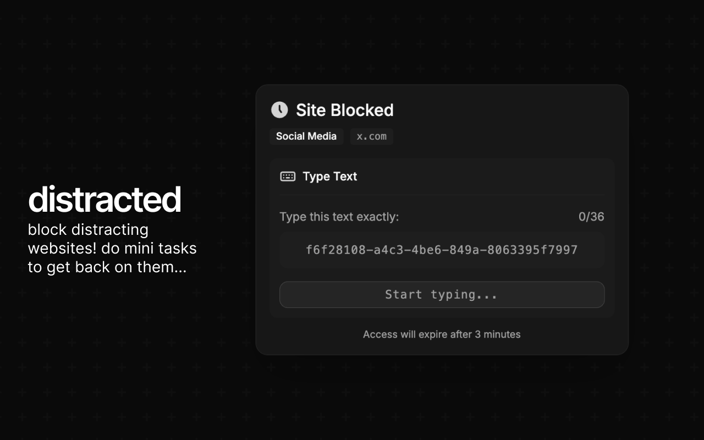

# @distracted/pi-extension

[Pi coding agent](https://github.com/badlogic/pi-mono) extension for distracted - enables real-time distraction blocking during AI coding sessions.

## Installation

### Via CLI (recommended)

```bash
bunx @distracted/server --setup pi
```

This will:

1. Install the extension globally (if needed)
2. Configure pi's `~/.pi/agent/settings.json` to load the extension

### Manual

1. Install the package:

```bash
npm install -g @distracted/pi-extension
```

2. Add to your pi settings (`~/.pi/agent/settings.json`):

```json
{
  "extensions": ["@distracted/pi-extension"]
}
```

## How it works

The extension subscribes to pi lifecycle events and sends them to the local distracted server:

| Pi Event             | Hook Event         | Description               |
| -------------------- | ------------------ | ------------------------- |
| `session_start`      | `SessionStart`     | Pi session started        |
| `before_agent_start` | `UserPromptSubmit` | User submitted a prompt   |
| `tool_call`          | `PreToolUse`       | Agent is executing a tool |
| `agent_end`          | `Stop`             | Agent finished processing |
| `session_shutdown`   | `SessionEnd`       | Pi session ended          |

## Configuration

### Port

By default, the extension sends events to `http://localhost:8765/hook`.

To use a different port, set the `DISTRACTED_PORT` environment variable:

```bash
DISTRACTED_PORT=9000 pi
```

Make sure the server is running on the same port:

```bash
bunx @distracted/server --port 9000
```

## Removal

```bash
bunx @distracted/server --remove pi
```

Or manually remove `@distracted/pi-extension` from your `~/.pi/agent/settings.json` extensions array.
