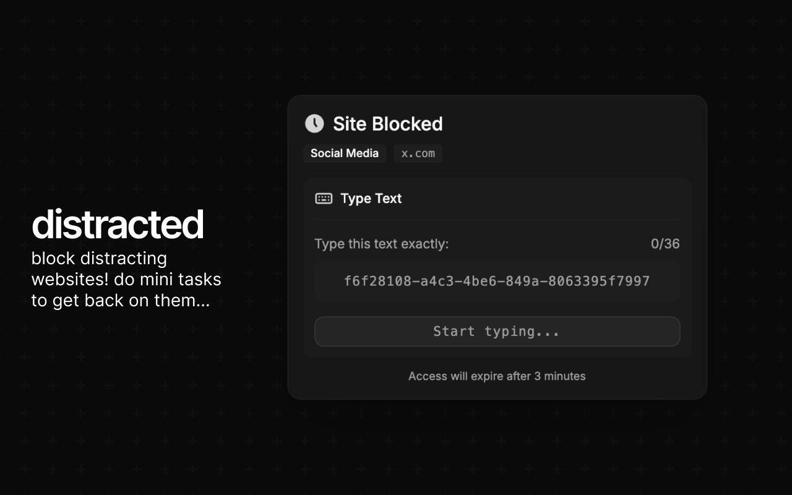

[](https://chromewebstore.google.com/detail/distracted/ggimjhcfchbfdhpehdekdiblbfmijngf)
[](https://addons.mozilla.org/en-GB/firefox/addon/distracted/)
[](https://github.com/f1shy-dev/distracted)

## what is this package?

local server that integrates with claude code hooks to enable real-time distraction blocking. receives hook events from claude code and forwards them to the extension via websocket.

## how to use

### setup

install the extension first! then run the server:

```bash
bunx @distracted/server
```

when ran for the first time, the CLI will add hooks to `~/.claude/settings.json` to forward events to the local server.

then the server will start on port 8765 by default (or use `--port <port>` to specify a different port).

in the extension, setup a distraction with Claude Blocker as the unlock method.

to remove the claude code hooks:

```bash
bunx @distracted/server --remove
```

## how it works

- claude code sends hook events (UserPromptSubmit, PreToolUse, SessionStart/End, etc.) to the local server via http post
- the server processes these events and maintains state about claude code activity
- the extension connects via websocket and receives real-time updates
- when claude code is inactive, the extension can activate distraction blocking

## credits

- @t3dotgg/[@theo](https://x.com/theo) for the original [claude-blocker](https://github.com/t3dotgg/claude-blocker)
- [opencode](https://github.com/anomalyco/opencode) for some small bits of CLI code ([`lib/ui.ts`](src/lib/ui.ts), [`lib/error.ts`](src/lib/error.ts))
